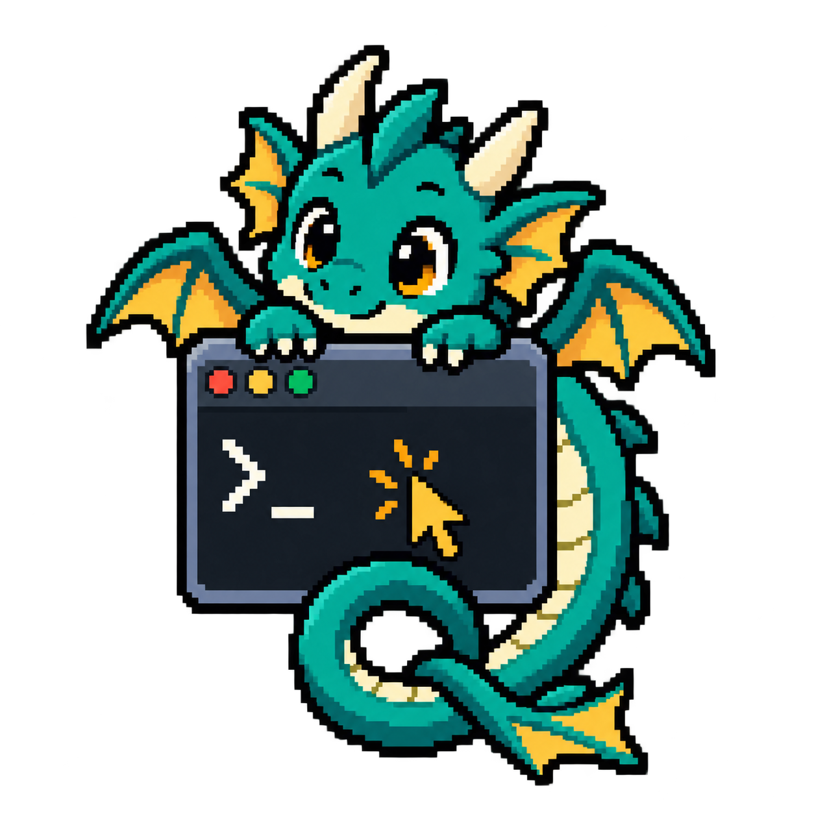
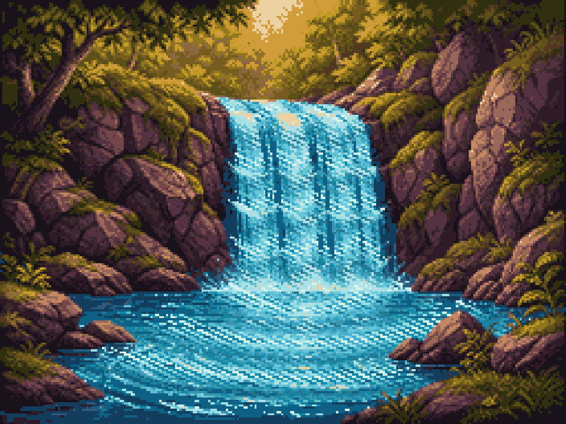
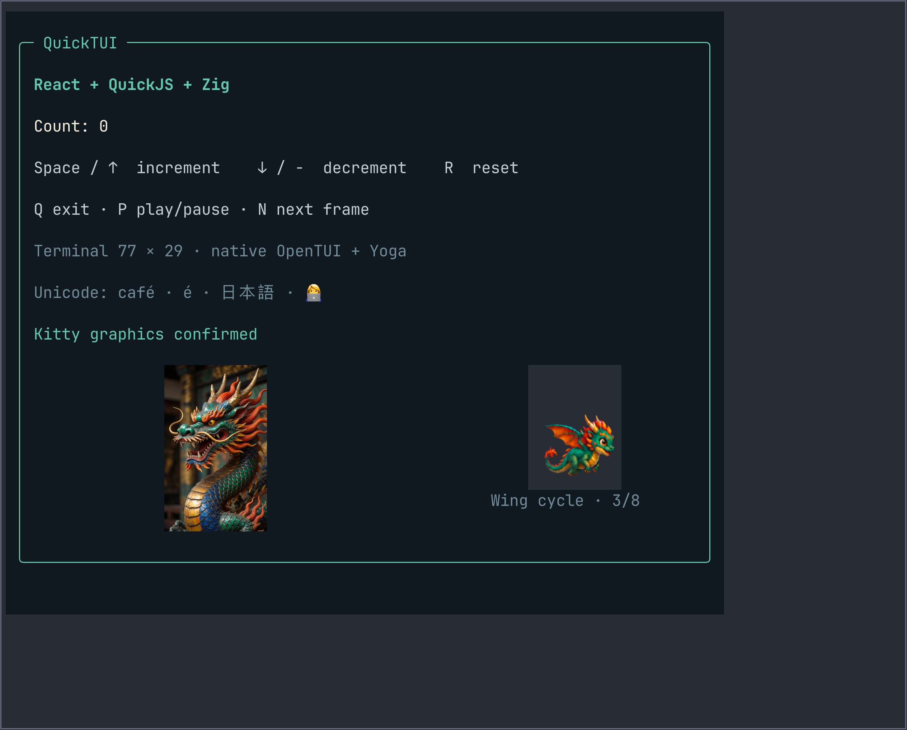
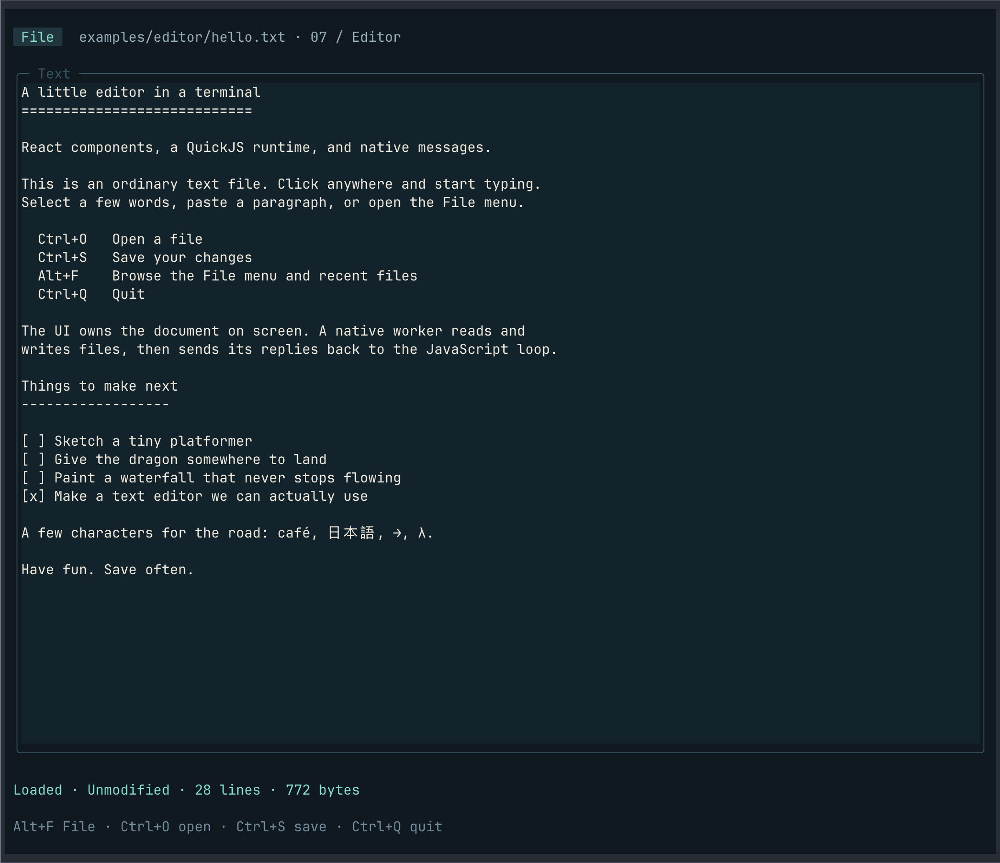

<p align="center">
  
</p>

# QuickTUI

What happens when you mash up OpenTUI, QuickJS, Zig, and an AI assistant with
entirely too many ideas for a terminal? Here you go.

QuickTUI runs React terminal interfaces inside an embedded QuickJS runtime,
with OpenTUI doing the rendering and Yoga layout. Zig builds the executables
and handles the native side. It started with a counter and a dragon. Now
there is a paint program with color cycling, a graphics lab full of rotating
4D shapes and moiré patterns, and a growing set of UI examples.

<p align="center">
  
</p>

*256 × 192 pixels, 32 colors. Made with AI-assisted image preparation, animated
in termpaint, and exported by its native GIF writer.*

## Try it

You need **Zig 0.16.0**. On macOS, you also need the Xcode command-line tools
and SDK. Sources, dependencies, and generated JavaScript are checked in;
a normal build does not download packages or need Node, npm, Bun, or a
separate QuickJS installation.

```sh
git clone git@github.com:awesomo4000/quicktui.git
cd quicktui
zig build -Doptimize=ReleaseSmall

# The original counter and dragon
./zig-out/bin/quicktui

# Paint a picture, or open the cycling waterfall
./zig-out/bin/termpaint examples/paint/waterfall/waterfall.tpaint
```

Termpaint starts in Unicode half-block mode. Press **C** to play the palette
cycle and **M** to try Kitty pixel graphics if your terminal supports it.
**H** opens Help, including guides you can copy to an AI assistant.

macOS arm64 is the setup exercised here, including tmux. Linux x86-64 musl
has been cross-compiled but has not been run here. See the
[build and terminal notes](GUIDE.md#build-and-run) for supported targets and
Kitty passthrough configuration.

## Things to play with

| Run | What is in it |
| --- | --- |
| `quicktui` | The first counter, dragon picture, and wing animation |
| `quicktui --mouse` | Clicks, dragging, hover, and scrolling |
| `quicktui --gallery` | Widgets, text editing, tabs, Markdown, tables, and more |
| `quicktui --messages` | A native worker exchanging queued messages with React, progress bars, and blinking activity squares |
| `quicktui --lab` | CPU-rendered shapes, a 4D hypercube, Mandelbrot, surface fractal dithering, color washes, and saved presets |
| `quicktui --live` | 06a: Load and replace components within one running JS runtime |
| `quicktui --game` | Tiny platformer with overlapping movement/jump controls and explicit legacy tap mode |
| `quicktui --keyboard` | Keyboard event, held-state, capability, and local latency diagnostic |

Apps can opt into press/repeat/release input and subscribe from React components
with `useKeyboardEvents`. Component filters can change at runtime; the native host
owns terminal mode setup and cleanup. See the [keyboard API](docs/application-api.md#higher-fidelity-keyboard-input)
and [tested terminal behavior](docs/keyboard-compatibility.md).
| `quicktui --reload` | 06b: Replace the whole JS runtime, restore a JSON snapshot, and retain the terminal display |
| `quicktui --editor [file]` | A small text editor with Open, Save, and recent files |
| `termpaint [file.tpaint]` | Pencil, brush, spray, fill, transparency, palette cycling, and animated GIF export |

The commands above use the executables in `zig-out/bin/`.
The [guide](GUIDE.md) has the controls and implementation details for each demo.
There are editable [sprite sheets and cycling scenes](examples/paint/) to start with.

<p align="center">
  
</p>

<p align="center">
  
</p>

## Why this combination?

This is mostly a matter of taste. I like writing interfaces with React, and I
like an application that builds into an executable with its runtime included.
I want to explore how much of that combination I can keep small and explicit.

React provides component composition, state, hooks, and lifecycle cleanup.
OpenTUI turns those components into terminal renderables and native drawing
operations. QuickJS runs the bundled JavaScript. There is no browser DOM here;
JSX describes terminal widgets.

The intended split is for JavaScript to describe the UI and for application
services to live on the native side, reached through messages. The message demo
shows a Zig worker sending progress and spontaneous events back to the UI.
The graphics lab uses the same idea for frame notifications, with pixel data
transferred separately from the small messages. The editor and paint app give
their workers file operations and GIF export.

That lets each app choose what to offer its UI without needing a general
Node or Bun environment inside the executable. The current bridge still exposes
native TUI operations, and some still use pointers. Poolside handles protect
the terminal-buffer read views so far. **This is not a sandbox for untrusted
JavaScript.** The live-loading demo currently runs trusted code in the same
context as the application.

A smaller executable and fewer runtime dependencies are design preferences,
not promises about every build. The demos share one bundled copy of their JS
libraries; termpaint has its own executable and bundle. The vendored native
library still brings its upstream dependency set, and macOS builds link system
frameworks. There is room to trim things as the project takes shape.

## Where the AI fits

An assistant has been helping build the code, try the demos, and prepare artwork.
The apps do not need an AI service to run. In termpaint, Help can copy instructions
for an assistant to read the painting format, prepare sprite sheets, turn an
image into a cycling palette, and operate the app.

The [termpaint skill](skills/termpaint/SKILL.md) and
[color-cycle art skill](skills/termpaint-color-cycle/SKILL.md) are kept in the
repository. Each generated scene includes its prompt, original image, and
preparation script. The pixels store palette indices; animation changes the
colors those indices refer to. Water moves while rocks stay put.

Part of the fun is seeing whether these pieces can grow into tools for making
and remixing little terminal games. For now, they are examples you can play with
and pull apart.

## Build your own app

Start with the [independent consumer example](examples/consumer/) and the
[application API](docs/application-api.md). QuickTUI supplies the consumer bundler,
React runtime, application startup, text paste events, and native message delivery.

## Working on it

```sh
zig build test

# After editing TypeScript or JSX, regenerate the checked-in bundles with Bun:
zig build bundle
zig build -Doptimize=ReleaseSmall
```

The [guide](GUIDE.md#tests) lists the extra PTY and tmux checks.
See the [bridge contract](js/platform/README.md),
[vendored dependencies and provenance](vendor/README.md), and
[changelog](CHANGELOG.md) for more detail.

## Thanks

This experiment depends on OpenTUI and its React integration, QuickJS, React,
Zig, Yoga, and the other libraries collected in [vendor/](vendor/README.md).
The surface fractal dithering experiments draw on Rune Skovbo Johansen's
[Dither3D](vendor/dither3d/). Poolside supplies the generational handle registry.
Their sources, license notices, and provenance are kept with the vendored code.

The [logo](assets/quicktui-logo.png) was generated with AI;
its [prompt](assets/quicktui-logo-prompt.md) is included too.
