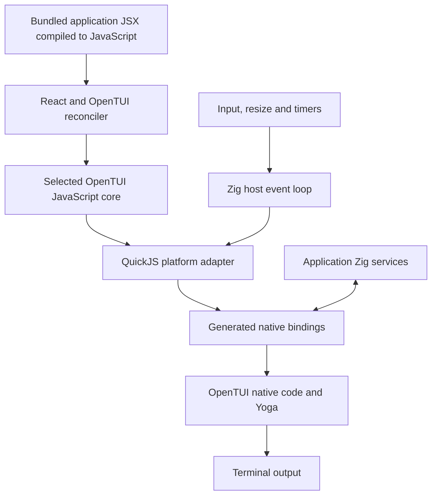

# Small standalone terminal apps with React, QuickJS, and Zig

Software concept and implementation proposal · 09/05/2026

## Purpose

Build a small application runtime that lets developers write terminal interfaces in JavaScript or TypeScript with React and OpenTUI, add native functionality in Zig, and distribute each application as one executable per supported platform.

The developer should get familiar components, hooks, state, flexbox layout, text styling, input fields, selection, and scrolling. The person running the application should download a binary and run it without installing JavaScript tooling or native dependencies separately.

The proposed runtime embeds QuickJS inside a Zig executable. QuickJS executes the bundled application, React, and a selected portion of OpenTUI's JavaScript implementation. Native bindings connect that code to OpenTUI's renderer and layout implementation, plus application-specific Zig functions.

This is a source-backed design proposal, not a working implementation or a measured size claim. The investigation inspected source and dependency declarations; it did not compile or run the combined stack.

## Investigation baseline

The inspected OpenTUI source archive identifies commit `7581976f4d2c917fd5ae5266c8bc61f0e44fc933`. Its archive metadata matches the repository's commit response. Core and React package manifests report `0.5.10`. Use this commit as the research baseline, not a promise that an unmodified published package supports QuickJS.

The baseline uses React `>=19.2.0` and `react-reconciler` `^0.33.0`. An implementation should lock exact compatible versions. Its native build declares Zig `0.16.0` as the minimum. QuickJS `2026-06-04` is the candidate engine version reviewed here. [Package manifests][packages] [React manifest][react-package] [Native dependencies][native-deps] [QuickJS documentation][quickjs]

Some indexed web pages still show native code under `packages/core/src/zig`. In this source revision it lives under `packages/native`. Source links below use the inspected commit.

## Architectural finding

OpenTUI already has a useful separation, but the native library is not the whole widget toolkit.

| Layer | Responsibility | Proposed treatment |
|---|---|---|
| Application React components | Application state, composition, event handlers | Execute in QuickJS |
| OpenTUI React renderer | Reconcile React elements into OpenTUI objects | Preserve, with a restricted component catalogue |
| OpenTUI JavaScript core | Widget behavior, component tree, focus, input dispatch, render coordination | Preserve selected features; adapt runtime dependencies |
| Native OpenTUI implementation | Cell buffers, rendering, text storage and editing, terminal facilities | Compile into the application |
| Yoga | Native flexbox layout | Preserve through OpenTUI's wrapper |
| Zig host | QuickJS lifetime, OS events, timers, native application services | Implement |

OpenTUI's React host configuration already creates native-facing component objects and applies React mutations to them. Reusing that reconciler preserves existing component semantics. Replacing it with a new renderer would create a different toolkit and should not be the starting plan. [React host configuration][host-config] [Renderable implementation][renderable]

The native build also publishes an `opentui` Zig module. That is useful for direct native integration, but it is not identical to the exported function layer used by the JavaScript package. Preserving those JavaScript bindings requires deliberately integrating the ABI implementation rooted at `src/lib.zig`, or adapting equivalent calls. Merely importing the Zig module does not complete the port. [Native build][native-build] [Zig module][native-module] [Export implementation][native-lib]

## Desired developer experience

A project contains an application entry point, a small configuration file, and optional Zig code. JavaScript tooling is used during development and builds. It is not part of the user's installation requirements.

Illustrative application code, showing the intended API rather than a tested program:

```tsx
import { useState } from "react";
import { useKeyboard } from "@opentui/react";
import { run } from "@tiny-tui/runtime";

function App() {
  const [count, setCount] = useState(0);

  useKeyboard((key) => {
    if (key.name === "space") setCount((value) => value + 1);
  });

  return (
    <box flexDirection="column" border padding={1}>
      <text>Count: {count}</text>
      <text>Press Space to increment. Ctrl+C exits.</text>
    </box>
  );
}

run(<App />);
```

`@tiny-tui/runtime` and `run` are proposed names. The wrapper would create the adapted OpenTUI renderer, mount the existing React root, and register cleanup. Application authors would not interact with pointers, the QuickJS embedding API, or terminal escape sequences.

Optional application-native functions should be imported through a typed application module. For example, a filesystem browser could call a Zig directory-listing service. These services are separate from OpenTUI's internal bindings and can be omitted from applications that do not need them.

## Runtime architecture



Use one QuickJS runtime on one owning thread for the first version. The host services OS events and JavaScript tasks; OpenTUI retains responsibility for deciding when its UI needs rendering. Avoid adding a second independent render loop that redraws unconditionally.

At each event-loop turn, deliver ready input or completed native work, execute due timers, and process pending JavaScript jobs. Bound work per turn so an endless stream of jobs does not starve input or resize handling. Sleep or poll when nothing is ready. A dirty frame should be scheduled through the adapted OpenTUI machinery.

Some native operations require synchronous JavaScript callbacks, especially layout measurement. Those callbacks must run on the owning thread and complete before the native call returns. They cannot all be replaced with asynchronous messages. Background native work must queue completion to the owning thread rather than enter QuickJS directly.

## Native interface inventory

The inspected `getOpenTUILib` symbol table contains **423 function declarations**, including optional features. This is an inventory of that binding table, not a minimum requirement for every application or a count of every export in the binary. [Binding table][zig-bindings]

The implementation must derive the required subset from the selected components and their initialization paths. These are representative existing symbols:

| Function group | Examples | When needed |
|---|---|---|
| Renderer lifecycle | `createRenderer`, `resizeRenderer`, `destroyRenderer` | Every interactive application |
| Frame presentation | `render`, `getNextBuffer`, `getCurrentBuffer` | Every rendered application |
| Drawing buffers | `createOptimizedBuffer`, `bufferClear`, `bufferDrawText`, `bufferFillRect`, `drawFrameBuffer` | Drawing and composition |
| Text and editing | `createTextBuffer`, `textBufferAppend`, text views and edit-buffer operations | Styled text; editing adds more operations |
| Layout | `yogaNodeCreate`, `yogaNodeCalculateLayout`, style accessors, measure callbacks | Flexbox components |
| Terminal state | `setupTerminal`, cursor operations, suspend/resume | Interactive terminal lifecycle |
| Events and lifetime | Event sinks, logging callbacks, destruction | Required by the retained implementation |

Additional families cover images, audio, clipboard services, embedded terminals, and diagnostics. They should enter the build only when their feature profile requires them.

### Binding approach

Implement a QuickJS backend at OpenTUI's existing FFI boundary. Its current abstraction includes library symbols, callback creation and disposal, pointer extraction, and native buffer views. The abstraction is a useful implementation seam, not a guarantee of plug-in compatibility. [FFI adapter][ffi]

Use generated, typed native wrappers for a known symbol set. At build time, maintain a manifest linking each selected function to its native signature, argument ownership, callback behavior, and feature group. Generate both Zig/C bridge code and JavaScript adapters. Verify declarations against the actual native types; a name-and-type list alone cannot establish memory ownership.

A compatibility implementation of `dlopen` can return a registry of statically linked functions. It need not load arbitrary shared libraries. Keep this facility internal, and validate the requested registry and symbols.

Do not assume the unmodified symbol table will become small through tree shaking. It eagerly describes all features. Split symbol registration by feature or generate a reduced table alongside the native build.

### Memory and callback contract

Keep integer object handles distinct from actual pointers. Use exact representations for 64-bit values. Do not coerce arbitrary addresses into JavaScript numbers.

For each argument, document whether bytes are borrowed for one call, copied by native code, or retained. Retained JavaScript storage must remain rooted, including typed-array backing buffers. Account for offsets, alignment, detachment, and output-buffer lengths. Prefer copying for infrequent calls until profiling justifies shared memory.

OpenTUI currently uses `bun-ffi-structs` for packing structures. Audit its implementation before retaining it; the package name alone does not establish compatibility. If necessary, replace packing at selected call sites with generated native conversions. Verify sizes, field offsets, enum widths, alignment, and endianness against the native implementation. [Struct definitions][structs]

Native callbacks need explicit registration and disposal. Stop callback producers and unregister callbacks before releasing referenced JavaScript values. Same-thread measurement callbacks need a defined error return path; capture JavaScript exceptions and report them after control returns safely. Native worker threads must never access the QuickJS context.

## JavaScript compatibility work

The host should provide only the services reached by the supported UI profile. It should not attempt general Node or Bun compatibility.

| Dependency or behavior | Proposed action |
|---|---|
| Timers, `queueMicrotask`, monotonic time | Supply host adapters; integrate pending jobs and React scheduling |
| Node-style terminal streams | Supply input events, raw mode, dimensions, resize, output and cleanup semantics |
| `EventEmitter` | Bundle a compatible JavaScript implementation |
| `Buffer`, `TextEncoder`, `TextDecoder` | Audit used methods; provide UTF-8 and byte-view behavior required by input and bindings |
| `process` fields and events | Provide a documented subset for arguments, environment, platform, streams and lifecycle |
| `node:module`, library-path discovery | Replace with compiled native registry and build-time resolution |
| Filesystem/path imports | Remove from basic UI initialization where possible; implement intentional application file access separately |
| Console capture and formatting | Provide a small diagnostic adapter; prevent logs from corrupting terminal drawing |
| Workers, parser downloads, runtime plugins | Exclude from the first profile and reject unsupported use clearly |
| React development tools | Compile out of production builds |

OpenTUI's renderer directly uses Node-style input streams. Its runtime helpers also import filesystem/path services. This work extends beyond connecting native drawing calls. [Renderer][renderer] [Runtime helpers][runtime]

### Unicode is an early compatibility test

Stock QuickJS does not implement ECMA-402 internationalization APIs. OpenTUI's `string-width` dependency at version `7.2.0` constructs `Intl.Segmenter` at module initialization. Consequently, this dependency can prevent startup before any component renders. [QuickJS language support][quickjs] [String-width implementation][string-width]

Prefer adapting width measurement and segmentation to OpenTUI's existing native Unicode facilities where equivalent operations are available. Add a narrow native operation if required. Verify semantics before substitution; stripping ANSI, grapheme segmentation, ambiguous-width policy, and terminal-cell width are related but different operations.

Do not replace grapheme segmentation with string length or code-point iteration. Acceptance examples must include combining marks, CJK text, emoji sequences, wrapping, and cursor movement. Remove optional diagnostic uses of `Intl` or supply their specific behavior separately.

## Feature profiles

### First useful profile

Target boxes, styled text, flexbox, keyboard input, focus, one-line input, selection lists, and scroll boxes. Preserve ordinary React state, effects, refs, and context through the existing reconciler. Support application-native calls through a small explicit interface.

The first vertical slice is narrower: a bordered React counter with native text rendering, keyboard updates, resize handling, and clean exit. Add input and scrolling only after that path works.

### Later profiles

Consider textareas, richer text, Markdown, mouse interactions, and clipboard integration next. Syntax highlighting, images, audio, embedded terminals, and runtime-loaded plugins are separate additions with explicit dependencies. Exclusion means the build reports an unsupported feature; it must not silently substitute an empty widget.

### Why profiles need source changes

The React component catalogue currently imports and retains constructors for code, diff, Markdown, image, and other components. A runtime lookup table can keep these reachable even when application JSX uses only a box. Create a generated catalogue and feature-specific core entry point. Inspect the bundle dependency graph to confirm exclusions. [Component catalogue][catalogue]

Native exclusions need matching build changes. The inspected build connects audio and image shims through a shared dependency helper and compiles Yoga C++ sources. It also has platform and optional embedded-terminal dependencies. Omitting a React component does not automatically omit its native libraries. [Native build][native-build]

## Building and distribution

The desired release is one executable for each supported OS/architecture pair, with application JavaScript and non-system native dependencies included. Normal operating-system libraries remain allowed. A universal binary that runs on every OS is not a requirement.

Proposed build sequence:

1. Resolve locked dependency versions and the selected feature profile.
2. Compile TSX/JSX and TypeScript into a production JavaScript bundle. Eliminate development branches and resolve package imports during the build.
3. Generate the restricted component catalogue, binding registry, and native feature configuration. Fail on unresolved built-ins or unsupported imports.
4. Embed JavaScript source into the executable for the initial implementation. Initialize host services before evaluating the application module.
5. Compile QuickJS C sources, the Zig host, OpenTUI's selected native implementation, Yoga and required native dependencies.
6. Link, strip the distribution copy, retain debug symbols separately, and emit dependency and license reports.
7. Test the release artifact on a clean machine or isolated environment without development runtimes installed.

QuickJS bytecode embedding is a later startup optimization. Its bytecode is tied to the engine version; it is not native compilation of the React code. Embedded source is the simpler initial packaging contract. [QuickJS compilation and embedding][quickjs]

The existing OpenTUI library build produces a dynamic library. Static integration requires build work and validation. During development, an executable with an adjacent library is acceptable for debugging, but that does not satisfy the single-executable release criterion. Do not assume that changing one linkage flag completes static integration.

Start with macOS arm64 and Linux x86-64, validating each independently. Add Windows after terminal lifecycle, native compilation, and QuickJS support are proven for that target. Cross-compilation must account for SDKs and C/C++ dependencies; Zig alone does not remove those requirements.

## Size and performance goals

Compactness is a measured product goal. No total binary-size claim follows from QuickJS's example executable size, React's package download size, or a compressed JavaScript bundle.

Record incremental measurements for the Zig host, QuickJS, React/reconciler, native OpenTUI/Yoga, and each feature profile. Measure stripped executable bytes, compressed download size, embedded JavaScript bytes, startup to first frame, idle memory, idle CPU, and input-to-frame latency.

Compare against the same screen running under supported OpenTUI on Bun. Initial responsiveness should aim to fit ordinary keyboard updates within a 16.7 ms frame budget on a named reference machine. This is a proposed target, not an observed result. Establish size and startup budgets after the first working slice rather than inventing a megabyte promise.

Inspect idle polling and JavaScript-to-native call frequency before optimizing. Batch operations where useful, but preserve synchronous layout behavior. A small interpreter may need different call patterns from a JIT-based runtime.

## Lifecycle and diagnostics

Normal exit, handled termination signals, initialization failure, and application exceptions should restore terminal modes and the cursor. A forced kill cannot promise cleanup.

Use coordinated shutdown: prevent new external work, unmount the React root while its renderer context is usable, stop native callback producers, destroy UI resources, cancel remaining timers, release JavaScript roots, and free QuickJS. Integrate with OpenTUI's existing destroy hooks so resources are not released twice.

The terminal output path must have one coordinated owner. Native frame output and JavaScript-originated control writes cannot interleave arbitrarily. Route diagnostics to a controlled log sink or display them after terminal restoration.

The first version executes bundled application code. Embedding QuickJS and providing selected native functions does not by itself establish an isolation boundary for hostile plugins.

## Implementation milestones and acceptance

| Milestone | Deliverable | Acceptance evidence |
|---|---|---|
| 1. Dependency audit | Locked sources, import graph, profile catalogue and binding manifest | Every reachable host dependency classified; unsupported imports fail clearly |
| 2. QuickJS host | JavaScript evaluation, jobs, timers, errors, native calls | React/reconciler probe handles state and effect cleanup; no browser engine required |
| 3. Native vertical slice | Real OpenTUI box/text/counter through QuickJS | Keyboard changes state and actual terminal output; resize and exit work |
| 4. Useful widgets | Input, focus, selection list and scrolling | Representative component behavior matches the supported-runtime baseline |
| 5. Packaging | Single executable for each initial target | Runs without Node, Bun, QuickJS installation, package directories, or adjacent OpenTUI library |
| 6. Optimization | Measured dependency trimming and performance report | Size contributions, startup, idle activity, and interaction latency recorded |

Use a pseudo-terminal test harness for input and terminal restoration. Compare normalized rendered cells or snapshots where terminal capability differences make byte-for-byte output inappropriate. Include rapid mount/unmount, resize during input, repeated native allocations, callbacks during shutdown, and retained-buffer lifetime tests.

All file-oriented tests use disposable directories under `/tmp`. No security or cleanup test may target system files or important user data.

## Decisions still requiring experiments

1. What exact subset of native functions and host APIs is reached by the first profile? The 423-entry table is only the starting inventory.
2. Can the current FFI abstraction be reused with modest patches, or is replacing selected `zig.ts` wrappers simpler?
3. Can `bun-ffi-structs` run under the proposed host, and would generated marshalling reduce complexity?
4. Which native Unicode operations reproduce the JavaScript width behavior needed by retained components?
5. How much native build surgery is required to exclude media and statically integrate the ABI implementation?
6. Does QuickJS deliver acceptable interaction latency for large lists and text updates with the retained JavaScript traversal?

Proceed if the real React/OpenTUI vertical slice works with a contained adapter and practical size/performance. Reconsider the scope if it requires recreating a broad Node runtime or replacing most widget behavior. The intended result is a reusable QuickJS port of a useful OpenTUI subset, so future applications mostly supply JavaScript UI and optional Zig functionality.

## Source map

OpenTUI links below are pinned to the inspected revision. External documentation links describe the reviewed engine and dependency behavior.

- [Core package and dependency declarations][packages]
- [React package and reconciler dependencies][react-package]
- [React host configuration][host-config]
- [React component catalogue][catalogue]
- [JavaScript renderables][renderable]
- [JavaScript renderer and terminal lifecycle][renderer]
- [Native binding table][zig-bindings]
- [Runtime FFI abstraction][ffi]
- [Packed native structures][structs]
- [Runtime helper dependencies][runtime]
- [Native build and linkage][native-build]
- [Native dependency manifest][native-deps]
- [Native Zig module][native-module]
- [Native exported implementation][native-lib]
- [QuickJS manual][quickjs]
- [String-width 7.2.0][string-width]

[packages]: https://github.com/anomalyco/opentui/blob/7581976f4d2c917fd5ae5266c8bc61f0e44fc933/packages/core/package.json
[react-package]: https://github.com/anomalyco/opentui/blob/7581976f4d2c917fd5ae5266c8bc61f0e44fc933/packages/react/package.json
[host-config]: https://github.com/anomalyco/opentui/blob/7581976f4d2c917fd5ae5266c8bc61f0e44fc933/packages/react/src/reconciler/host-config.ts
[catalogue]: https://github.com/anomalyco/opentui/blob/7581976f4d2c917fd5ae5266c8bc61f0e44fc933/packages/react/src/components/index.ts
[renderable]: https://github.com/anomalyco/opentui/blob/7581976f4d2c917fd5ae5266c8bc61f0e44fc933/packages/core/src/Renderable.ts
[renderer]: https://github.com/anomalyco/opentui/blob/7581976f4d2c917fd5ae5266c8bc61f0e44fc933/packages/core/src/renderer.ts
[zig-bindings]: https://github.com/anomalyco/opentui/blob/7581976f4d2c917fd5ae5266c8bc61f0e44fc933/packages/core/src/zig.ts
[ffi]: https://github.com/anomalyco/opentui/blob/7581976f4d2c917fd5ae5266c8bc61f0e44fc933/packages/core/src/platform/ffi.ts
[structs]: https://github.com/anomalyco/opentui/blob/7581976f4d2c917fd5ae5266c8bc61f0e44fc933/packages/core/src/zig-structs.ts
[runtime]: https://github.com/anomalyco/opentui/blob/7581976f4d2c917fd5ae5266c8bc61f0e44fc933/packages/core/src/platform/runtime.ts
[native-build]: https://github.com/anomalyco/opentui/blob/7581976f4d2c917fd5ae5266c8bc61f0e44fc933/packages/native/build.zig
[native-deps]: https://github.com/anomalyco/opentui/blob/7581976f4d2c917fd5ae5266c8bc61f0e44fc933/packages/native/build.zig.zon
[native-module]: https://github.com/anomalyco/opentui/blob/7581976f4d2c917fd5ae5266c8bc61f0e44fc933/packages/native/src/opentui.zig
[native-lib]: https://github.com/anomalyco/opentui/blob/7581976f4d2c917fd5ae5266c8bc61f0e44fc933/packages/native/src/lib.zig
[quickjs]: https://bellard.org/quickjs/quickjs.html
[string-width]: https://github.com/sindresorhus/string-width/blob/v7.2.0/index.js
